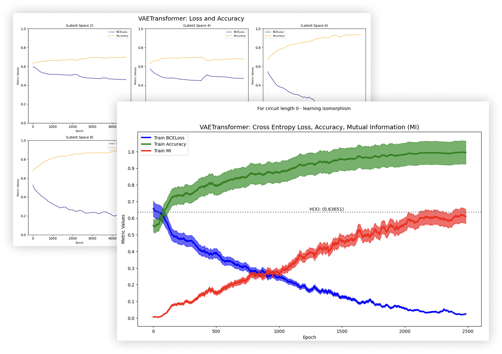

#### Princeton Gopalakrishnan Group

 

<h3 align="center">QuantumDynamicsAI</h3>

  

    Using a custom ML architecture that weaves the embedding power of Variational AutoEncoders with the Seq2Seq capabilities of transformers (specifically the attention mechanism) to predict controlled quantum dynamics. The dynamics have conservations simulated by a Qiskit brickworks circuit.
     
     
    <a href="https://github.com/sonnyloweus/QuantumDynamicsAI"><strong>Github Repo »</strong></a>
     
     
    <a href="https://github.com/sonnyloweus">Sonny Lowe</a>
     
    Extension of work done by Niel Hazra.
  

## Built With
* [![Python][Python.org]][Python-url]
* [![Jupyter Notebook][Jupyter.org]][Jupyter-url]
* [![Qiskit][Qiskit.org]][Qiskit-url]
* [![PyTorch][PyTorch.org]][PyTorch-url]

[Python.org]: https://img.shields.io/badge/Python-3776AB?style=for-the-badge&logo=python&logoColor=white
[Python-url]: https://www.python.org/

[Jupyter.org]: https://img.shields.io/badge/Jupyter-DA5B0B?style=for-the-badge&logo=jupyter&logoColor=white
[Jupyter-url]: https://jupyter.org/

[Qiskit.org]: https://img.shields.io/badge/Qiskit-6929C4?style=for-the-badge&logo=IBM&logoColor=white
[Qiskit-url]: https://qiskit.org/

[PyTorch.org]: https://img.shields.io/badge/PyTorch-EE4C2C?style=for-the-badge&logo=pytorch&logoColor=white
[PyTorch-url]: https://pytorch.org/

(<a href="#readme-top">back to top</a>)
